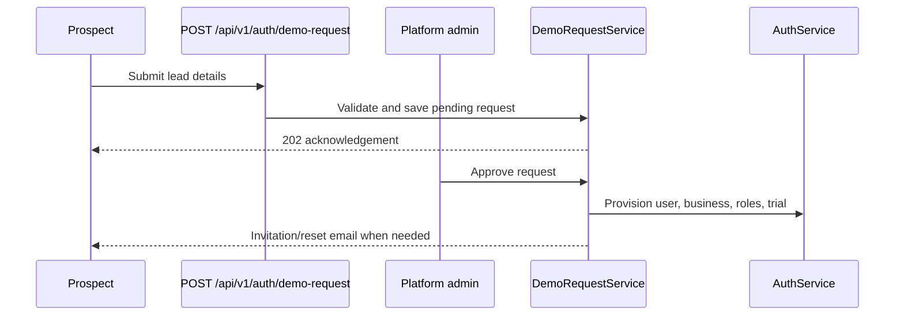

# Authentication and onboarding

The public signup flow is demo-request based. A prospect requests access, a
platform admin reviews the request, and tenant provisioning happens only on
approval.

Primary codepaths:

- `identity/infrastructure/web/AuthController.java`
- `identity/application/service/DemoRequestService.java`
- `admin/infrastructure/web/AdminDemoRequestController.java`
- `identity/infrastructure/security/SecurityConfig.java`
- `src/main/resources/db/migration/V60__demo_request.sql`
- `src/main/resources/db/migration/V61__demo_request_lead_fields.sql`

## Public auth endpoints

All routes are under `/api/v1`.

| Method | Path | Auth | Purpose |
| --- | --- | --- | --- |
| `POST` | `/auth/login` | Public | Login |
| `POST` | `/auth/demo-request` | Public | Request demo access |
| `POST` | `/auth/refresh` | Public | Refresh access token |
| `POST` | `/auth/forgot-password` | Public | Request password reset |
| `POST` | `/auth/reset-password` | Public | Complete password reset |
| `POST` | `/auth/change-password` | JWT | Change current password |

There is no public self-register endpoint. New tenants are created by approving
a demo request.

## Demo request submission

`POST /api/v1/auth/demo-request` accepts:

```json
{
  "fullName": "Awa Diallo",
  "email": "awa@example.com",
  "phone": "+221771234567",
  "businessName": "Boutique Awa",
  "message": "Je veux tester la caisse et le stock.",
  "jobTitle": "Owner",
  "city": "Dakar",
  "sector": "Retail"
}
```

Constraints come from `DemoRequestSubmitRequest`:

- `fullName`: required, 2-255 characters.
- `email`: required, valid email. The service normalizes it to lowercase.
- `phone`: required, 8-50 characters.
- `businessName`: required, 2-255 characters.
- `message`: optional, max 2000 characters.
- `jobTitle`, `city`, `sector`: optional, max 128 characters each.

The response is HTTP 202 with a user-facing acknowledgement message.

## Duplicate and validation rules

`DemoRequestService.submit` rejects the request when:

- a user already exists with the same email;
- a business already uses the same email;
- another pending demo request exists for the same email.

The service logs a `DEMO_REQUEST` audit event and attempts to send a received
email. Email failures do not block the saved request.

## Platform-admin review

Platform-admin routes are under `/api/v1/admin/**` and require
`ROLE_PLATFORM_ADMIN`.

| Method | Path | Purpose |
| --- | --- | --- |
| `GET` | `/admin/demo-requests?status=pending&page=0&size=20` | List demo requests |
| `POST` | `/admin/demo-requests/{id}/approve` | Approve and provision tenant |
| `POST` | `/admin/demo-requests/{id}/reject` | Reject with optional reason |

Approval behavior:

1. The request must still be `pending`.
2. `AuthService.provisionTenantAfterDemoApproval` creates the user, business,
   initial system roles, and trial subscription.
3. The demo request is marked approved by the admin user id.
4. A `DEMO_REQUEST_APPROVED` audit event is written.
5. If the demo request did not already contain a password hash, a password reset
   token is created and an invitation email is sent.

Rejection behavior:

1. The request must still be `pending`.
2. The request is marked rejected with an optional reason.
3. A `DEMO_REQUEST_REJECTED` audit event is written.
4. A rejection email is attempted.

## Sequence



## Developer notes

- Public access is configured in `SecurityConfig.PUBLIC_PATHS`.
- Demo request lead fields were added in migration `V61`.
- Use Maildev (`http://localhost:1080`) to inspect local demo, invitation, and
  rejection emails.
